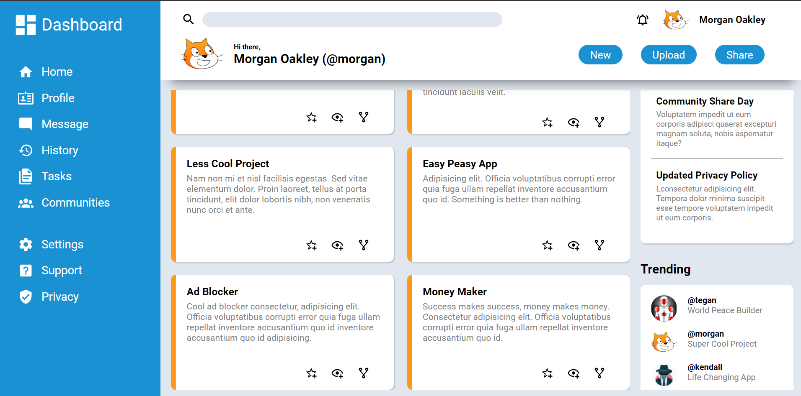

# admin-dashboard
A simple admin dashboard page using CSS grid

Solution for the [PROJECT: ADMIN DASHBOARD](https://www.theodinproject.com/paths/full-stack-javascript/courses/intermediate-html-and-css/lessons/admin-dashboard) from the [Intermediate HTML and CSS](https://www.theodinproject.com/paths/full-stack-javascript/courses/intermediate-html-and-css#intermediate-html-concepts) part of [The Odin Project](https://www.theodinproject.com/).

## Table of contents
- [Overview](#overview)
  - [Solution Screenshot](#solution-screenshot)
  - [Links](#links)
- [My process](#my-process)
  - [Built with](#built-with)
- [Author](#author)

### Solution Screenshot
The final output:

Currently it's only for Desktop. I'll make responsive later

### Links
Live Site URL: [Live site of the challenge hosted here](#)

## My process
Hello, this is my 6th project here in The Odin Project. It's a little complex structured admin dashboard page. I've used only CSS Grid for the structure of this project. The purpose of this project was practicing grid.

### Built with
- Basic HTML5 markup
- CSS
- Grid

## Author
- Website - Well I haven't made my profile portfolio, gonna make it soon when I know a lot of stuffs.
- LinkedIn - [@mainul islam](https://www.linkedin.com/in/mainul-islam-nirob/)
- Frontend Mentor - [@mainul](https://www.frontendmentor.io/profile/Mainul-Islam-Nirob)
- Twitter - [@mainul](https://twitter.com/Mainuli96601040)
- FreeCodeCamp - [@mainul](https://www.freecodecamp.org/mainul)